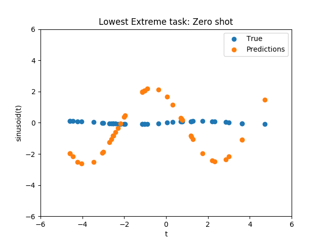
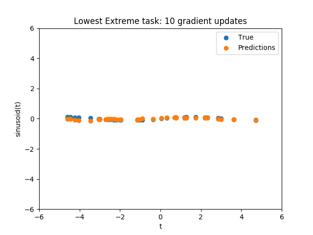
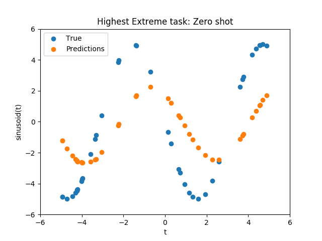
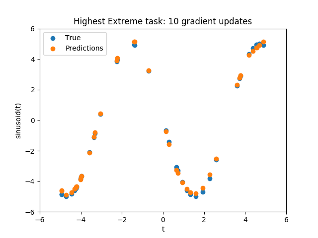

# maml
An Implementation of [Model Agnostic Meta Learning](https://arxiv.org/abs/1703.03400).
In particular, I've implemented the sinusoid experiment from the paper.

# How to run

To setup:
```
pip install -e .
```
Please create an issue if you find any missing dependencies! 


To train a network
```
python regression_example.py
```
Useful flags:
- `--device`: "cpu" or "gpu". Defaults to "cpu".

You can set other flags optionally. Check `regression_example.py` to see the full list of flags.

To demo a network:
```
python regression_example.py --demo --results-dir <path to directory where network is stored>
```
The network is assumed to be named `regressor.pt`. The training script will automatically save the network in `results/regressor.pt`

# Results
<p float="left">
  
   
</p>

**Results on low end of sinusoid task distribution**

<p float="left">
  
   
</p>

**Results on high end of sinusoid task distribution**

<p float="left">
  
   
</p>


# Sources
- [Oscar Knagg's blog post](https://towardsdatascience.com/advances-in-few-shot-learning-reproducing-results-in-pytorch-aba70dee541d)
