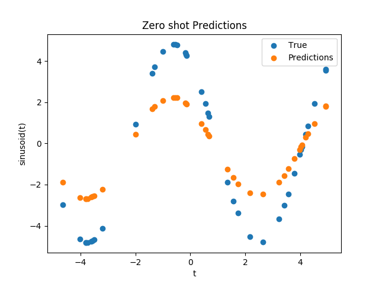
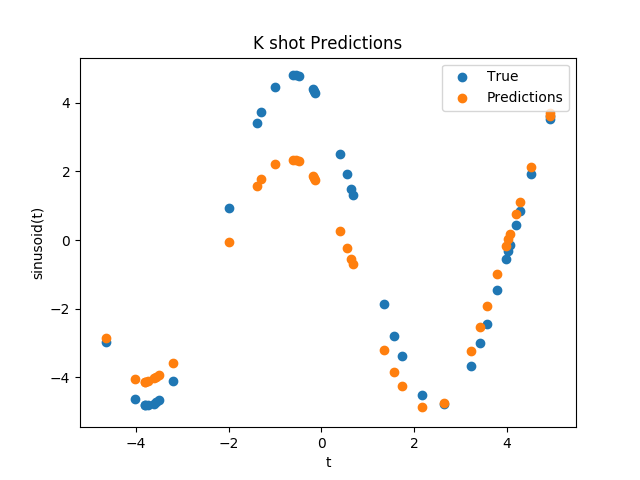

# maml
An Implementation of [Model Agnostic Meta Learning](https://arxiv.org/abs/1703.03400).
In particular, I've implemented the sinusoid experiment from the paper.

# Results

  
   

# Sources
- [Oscar Knagg's blog post](https://towardsdatascience.com/advances-in-few-shot-learning-reproducing-results-in-pytorch-aba70dee541d)
